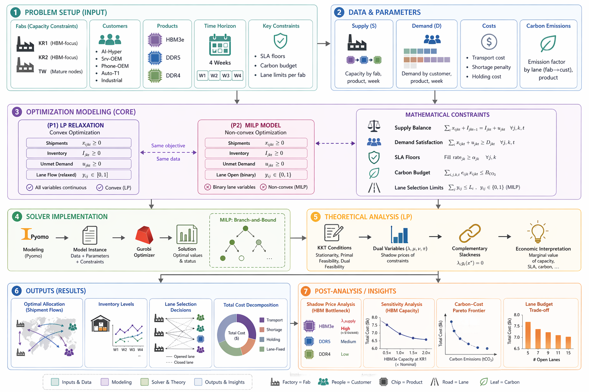

# Memory-Chip Allocation under the AI-Memory Supercycle

A multi-period MILP study of how a memory manufacturer should allocate scarce HBM3e / DDR5 / DDR4 output across heterogeneous customer classes during the 2024–2026 AI-memory shortage. Built in **Pyomo**, solved with **Gurobi**, with reproducible input data as plain CSVs.
<p align="center">
  
</p>
## 1. Quick start

```bash
# one-time install (Gurobi ships with a free restricted-size license)
pip install pyomo gurobipy pandas numpy matplotlib

# pipeline
python3 generate_data.py    # rebuilds data/*.csv from a fixed seed
python3 solve.py            # builds Pyomo model → Gurobi → output/results.json
python3 plots.py            # reads results.json → figs/*.pdf
```

`solve.py` finishes in a second or two on the shipped instance. Output:

```
z*_LP   =  7101.74   (transport 998, shortage 5529, holding 570, lane 5)
z*_MILP =  7250.01   (transport 1005, shortage 5533, holding 572, lane 140)
open lanes : 7 / 15,  MILP gap vs LP = 2.09 %
```

## 2. What the model captures

The instance is 3 fabs × 5 customer classes × 3 products × 4 planning periods (weeks of Q1 2026).

| Symbol          | Meaning                                            | CSV                   |
| --------------- | -------------------------------------------------- | --------------------- |
| `x[i,j,p,t]`    | units shipped fab i → customer j, product p, period t | decision variable |
| `u[j,p,t]`      | unmet demand                                       | decision variable     |
| `Inv[i,p,t]`    | end-of-period inventory at fab i                   | decision variable     |
| `y[i,j]`        | lane (i,j) opened over horizon (binary)            | decision variable     |
| `S[i,p,t]`      | supply                                             | `supply.csv`          |
| `D[j,p,t]`      | demand                                             | `demand.csv`          |
| `c[i,j,p]`      | transport cost                                     | `transport_cost.csv`  |
| `π[j,p]`        | shortage penalty                                   | `shortage_penalty.csv`|
| `φ[j,p]`        | minimum SLA fill-rate                              | `sla_min.csv`         |
| `h[p]`          | per-period holding cost                            | `holding_cost.csv`    |
| `e[i,j]`        | kg CO₂ per shipped unit                            | `emissions.csv`       |
| `F, K, B, M`    | lane fixed cost / lanes per fab / carbon budget / big-M | `params.csv`     |

Constraints: supply balance with inventory carry-over, demand balance, SLA floors for contracted customers, big-M lane linking, lane cardinality per fab, and a global carbon budget.

## 3. Dataset layout

Everything lives in `data/`. All CSVs are long-format (one row per tuple), UTF-8, comma-separated.

```
data/
├── suppliers.csv         supplier_id, name, country, has_hbm_packaging
├── customers.csv         customer_id, name, tier, country
├── products.csv          product_id, name, generation, requires_advanced_packaging
├── periods.csv           period_id, label
├── supply.csv            supplier_id, product_id, period_id, supply_kwe
├── demand.csv            customer_id, product_id, period_id, demand_kwe
├── transport_cost.csv    supplier_id, customer_id, product_id, cost_per_unit
├── shortage_penalty.csv  customer_id, product_id, penalty_per_unit
├── sla_min.csv           customer_id, product_id, min_fill_rate
├── holding_cost.csv      product_id, cost_per_unit_period
├── emissions.csv         supplier_id, customer_id, kg_co2_per_unit
└── params.csv            param_id, value, description
```

**All units:** quantities are kWE (thousand wafer-equivalent units); money is \$k; CO₂ is kg.

To try a variant, edit any CSV by hand and rerun `solve.py`. To reset, rerun `generate_data.py`.

## 4. Files

| File                | Purpose                                                        |
| ------------------- | -------------------------------------------------------------- |
| `generate_data.py`  | Writes the 12 CSVs in `data/`. Seed 42 → deterministic.        |
| `solve.py`          | Pyomo model + Gurobi solver + sensitivity scan → `output/results.json`. |
| `plots.py`          | Reads `output/results.json` → four PDFs in `figs/`.            |
| `data/`             | Input dataset (above).                                         |
| `output/results.json` | Canonical machine-readable output of one run.                |
| `figs/`             | Four figures: `allocation.pdf`, `shadow.pdf`, `lp_vs_milp.pdf`, `sensitivity.pdf`. |

## 5. Reproducibility notes

- The data seed is fixed at 42 in `generate_data.py`.
- `solve.py` calls Gurobi through `pyo.SolverFactory("gurobi")`; LP duals are imported via `pyo.Suffix(direction=pyo.Suffix.IMPORT)` on the LP-relaxation solve.
- The LP and MILP share the same `build_model()` function; `relax_binary=True` turns `y` from `Binary` into `[0,1]` continuous so the relaxation's dual multipliers are meaningful.
- Sensitivity scan multiplies Fab-KR1's HBM3e supply by a sequence of multipliers and resolves the LP each time.

## 6. Citation / acknowledgement

This project was built for 06-664 / 06-665 (Design and Optimization of Sustainable Processes / Process Systems Modeling) at Carnegie Mellon University. The base allocation formulation follows Ng, Sun & Fowler (EJOR 2010); the multi-period rolling-horizon spirit follows Herding & Mönch (CEJOR 2024); the sustainable / resilient extension is in the style of Tsao, Tesfaye-Balo & Lee (IJPE 2024).
